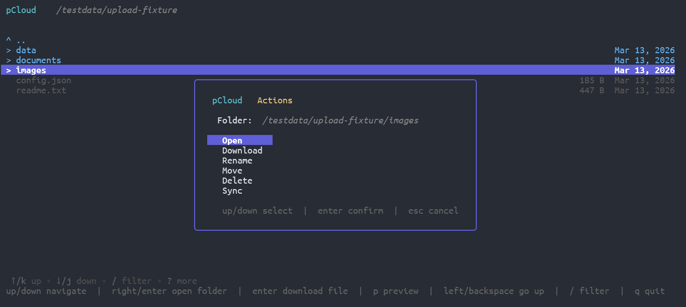
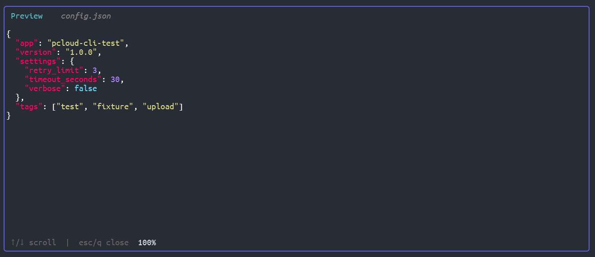
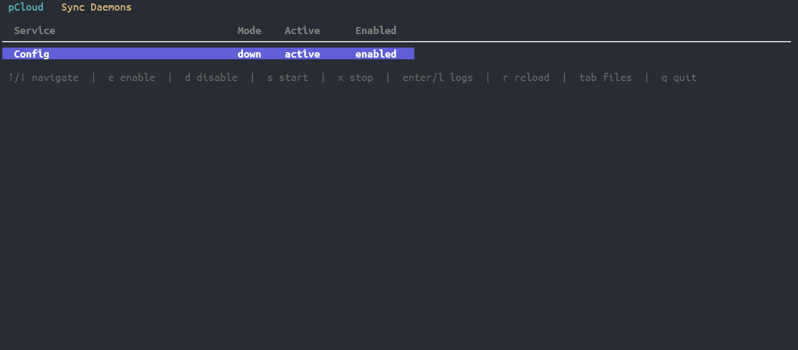

# pCloud-cli - pCloud Command Line Interface

[](https://goreportcard.com/report/github.com/saintedlama/pcloud-cli)

Command line interface to pCloud API written in Go.

## It's a TUI too!

File Browser


File Preview


Sync Daemon Management


## Installation

**Download a pre-built binary** from the [releases page](https://github.com/saintedlama/pcloud-cli/releases/latest).
Builds are provided for Linux, macOS, and Windows (amd64 and arm64).
Download the archive for your platform, extract it, and place the `pcloud-cli` binary somewhere on your `PATH`.

Or install with Go:

```sh
go install github.com/saintedlama/pcloud-cli@latest
```

## Contributing & Building from Source

Clone the repository and run `make build` to compile the binary locally — Go 1.26 or later is required.

Run `go test ./...` to execute the test suite, and `make fmt` to verify formatting before opening a pull request.

The CI pipeline enforces `gofmt`, `go vet`, a full build, and all tests, so running those locally first is the fastest way to spot issues.

```sh
git clone https://github.com/saintedlama/pcloud-cli.git
cd pcloud-cli
make build   # produces ./pcloud-cli
go test ./...
make install # optional, moves binary to $GOPATH/bin or $GOBIN
```

## Setup

Run `onboard` once to authenticate and save credentials to `~/.pcloud.json`:

```sh
pcloud-cli onboard
```

The wizard will ask for your region (US / EU), email, and password. Only a
session token is stored — your password is never saved.

## Usage

```
Usage:
  pcloud-cli [flags]
  pcloud-cli [command]

Available Commands:
  completion  Generate the autocompletion script for the specified shell
  file        Actions to manage files.
  folder      Actions to manage folders.
  help        Help about any command
  onboard     Set up pcloud-cli for the first time.
  sync        Sync between a pCloud folder and a local directory.
  tui         Open an interactive file browser.
  version     Print the version number of pCloud-cli

Flags:
      --config string   config file (default is $HOME/.pcloud.json)
  -h, --help            help for pcloud-cli
  -v, --verbose         verbose output for debugging
```

### `file` — manage remote files

```
Usage:
  pcloud-cli file [command]

Available Commands:
  checksum    Calculate checksums of file.
  copy        Copy file to another location.
  delete      Delete file.
  get         Get remote file url and download it.
  rename      Rename / Move source file.
  upload      Upload local file to remote folder.
```

### `folder` — manage remote folders

```
Usage:
  pcloud-cli folder [command]

Available Commands:
  create      Create folder.
  delete      Delete folder.
  download    Download and extract a remote folder.
  list        List folders in pCloud directory.
  rename      Rename / Move folder.
```

### `sync` — mirror directories

Sync keeps a local directory and a pCloud directory in step.

```
Usage:
  pcloud-cli sync <pcloud-path> [local-dir] [flags]
  pcloud-cli sync [command]

Available Commands:
  daemon      Sync continuously, polling pCloud for changes.
  systemd     Install a systemd user service for continuous sync.

Flags:
      --interval duration   polling interval used by the daemon (default 1m0s)
      --mode string         sync direction: "down" (pCloud → local) or "up" (local → pCloud) (default "down")
```

**Download** (pCloud → local) — default direction:

```sh
pcloud-cli sync /Music ./Music
# or explicitly:
pcloud-cli sync /Music ./Music --mode down
```

Only files newer on pCloud are downloaded; files deleted from pCloud are
removed locally.

**Upload** (local → pCloud):

```sh
pcloud-cli sync /Music ./Music --mode up
```

Files locally newer or absent on pCloud are uploaded; remote files no longer
present locally are deleted from pCloud. Both `<pcloud-path>` and `<local-dir>`
are required in upload mode.

**Continuous daemon:**

```sh
pcloud-cli sync daemon /Music ./Music --interval 5m
```

**Install as a systemd user service:**

```sh
pcloud-cli sync systemd /Music ./Music --interval 5m
# dry-run to preview unit file without writing anything:
pcloud-cli sync systemd /Music ./Music --dry-run
```

### `tui` — interactive file browser

```sh
pcloud-cli tui
```

Opens a terminal UI for browsing, downloading, and managing files.

## Build

Clone the repository and run:

```sh
make build
```

```sh
make install
```